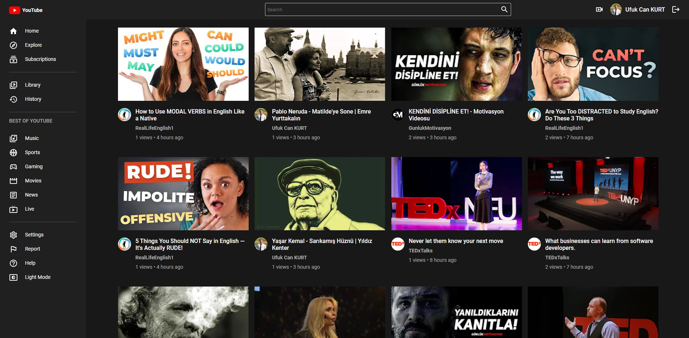
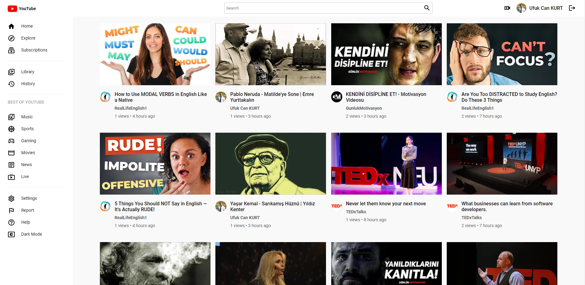
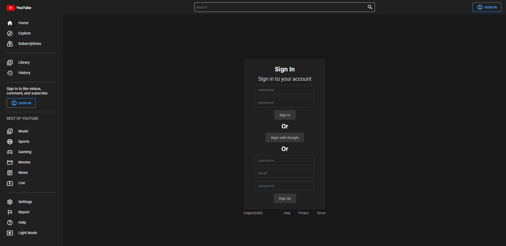
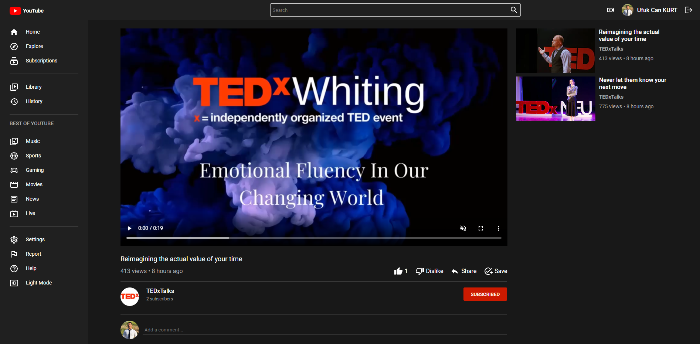
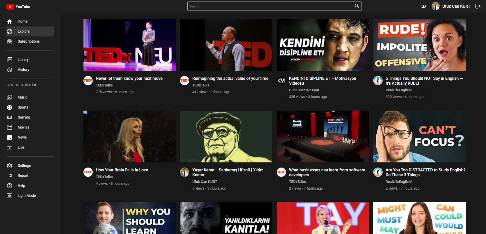
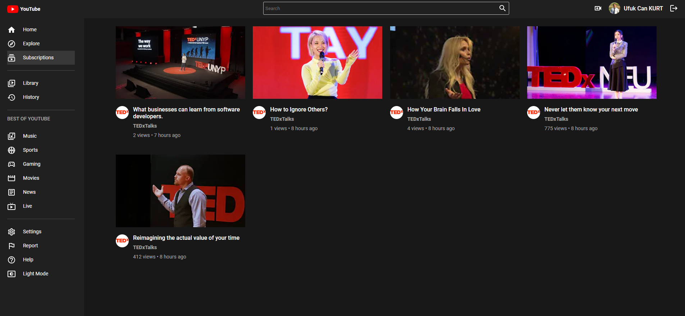

# Youtube App 📽

- ***You can either register normally or log in using your google account.***
- ***After logging in, you can add new videos, like and comment on videos.***
- ***You can subscribe to channels, so you can follow the videos of your favorite channels.***
- ***Application developed using `styled components`.***
- ***You can choose the theme we want using dark & light mode.***
- ***[`Firebase`](https://firebase.google.com/) was used to store images and videos in the cloud.***
- ***[`Redux`](https://redux.js.org/) used for state management.***

## Built With 🛠
<ul>
<li>
<a target="_blank" href="https://styled-components.com/">Styled Components</a>
</li>     
<li>
<a target="_blank" href="https://reactjs.org/">React.js</a>
</li>
<li>
<a target="_blank" href="https://www.mongodb.com/atlas/database">MongoDB</a>
</li>     
<li>
<a target="_blank" href="https://expressjs.com/">Express.js</a>
</li>   
<li>
<a target="_blank" href="https://nodejs.org/en/docs/">Node.js</a>
</li>     
<li>
<a target="_blank" href="https://firebase.google.com/">Firebase</a>
</li>  
</ul>


## Installation ⚡

<ul>

<li>
<p>Clone the repo</p>
<pre>
<code>git clone git@github.com:ufukcankurt/react-youtube-app.git</code>
</pre>
</li>
<li>
<p>İnstall all dependencies</p>
<pre>
<code> yarn ||  yarn install </code>
</pre>
</li>
<li>
Create .env file at the top of the application and add these parameters
<pre>
<code> REACT_APP_FIREBASE_APIKEY=</code>
<code> REACT_APP_FIREBASE_AUTHDOMAIN=</code>
<code> REACT_APP_FIREBASE_PROJECTID=</code>
<code> REACT_APP_FIREBASE_STORAGEBUCKET=</code>
<code> REACT_APP_FIREBASE_MESSAGINGSENDERID=</code>
<code> REACT_APP_FIREBASE_APPID=</code>
</pre>
</li>
<li>
<p>Run the development server:</p>


```bash
npm run dev
# or
yarn dev
```

</li>
</ul>

## Screenshots 📸

> ***App home page dark & light mode***

<p align="center" style="padding: 10px">



> ***If you have an account you can login otherwise you have to register***

<p align="center" style="padding: 10px">


> ***This page is the video detail page. You can like and comment on the video. You can subscribe to the channel. You can also see similar videos on the right side.***

<p align="center" style="padding: 10px">


> ***The Explore page lets you discover popular videos based on the highest number of views in the app.***

<p align="center" style="padding: 10px">


> ***The Subscriptions page is where you can see the videos of your subscribed channels in the app.***

<p align="center" style="padding: 10px">


